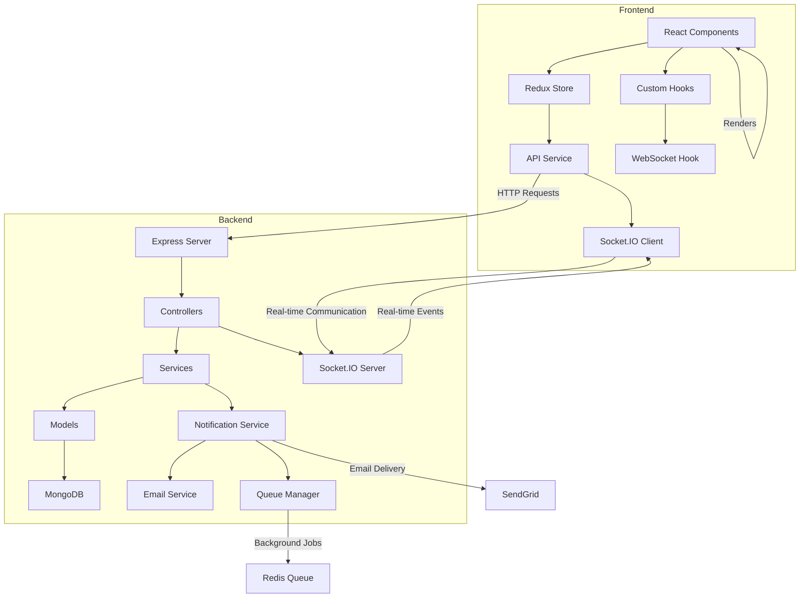

# 🎯 Trello-Style Project Management Dashboard

## ✨ Features

### 🔐 **Authentication System**
- **Email-based OTP login** (no password required)
- Secure JWT token-based authentication
- Automatic session management and persistence
- Protected routes with role-based access

### 📋 **Project & Task Management**
- **Project Dashboard** - Create, view, and manage multiple projects
- **Task CRUD Operations** - Create, read, delete tasks
- **Real-time Updates** - Instant synchronization across all connected users
- **Phase Management** - workflow phases (Proposed, Todo, In Progress, Done, Deployed)

### 👑 **Super-User Controls**
- **Admin Toggle** - Secure password-protected super-user mode
- **Enhanced Metadata** - View creation/update timestamps and user information

### 🔔 **Real-time Notifications**
- **Live Activity Feed** - Real-time notifications for active users
- **Email Notifications** - Automatic email delivery for offline users
- **WebSocket Integration** - Instant updates across all connected clients
- **Notification Center** - Centralized notification management
- **Multi-channel Delivery** - Email, UI, and push notification support


## 🛠️ Technologies Used

### **Backend Stack**
- **Node.js** - JavaScript runtime environment
- **Express.js** - Web application framework
- **TypeScript** - Type-safe JavaScript development
- **MongoDB** - NoSQL database with Mongoose ODM
- **Socket.IO** - Real-time bidirectional communication
- **JWT** - JSON Web Tokens for authentication
- **SendGrid** - Email delivery service


### **Frontend Stack**
- **React 19** - Modern React with latest features
- **TypeScript** - Type-safe frontend development
- **Vite** - Fast build tool and development server
- **Redux Toolkit** - Predictable state management
- **React Router** - Client-side routing
- **Axios** - HTTP client for API calls
- **Socket.IO Client** - Real-time communication

## 🏗️ Architecture



## 🚀 Getting Started

### **Prerequisites**
- Node.js (v18 or later)
- MongoDB (local or Atlas)
- SendGrid account (for email notifications)
- Git

### **Installation**

1. **Clone the repository:**
   ```bash
   git clone https://github.com/AnkitPatel1999/trello.git
   cd trello
   ```

2. **Backend Setup:**
   ```bash
   cd backend
   npm install
   # Edit .env with your configuration
   npm run dev
   ```

3. **Frontend Setup:**
   ```bash
   cd frontend
   npm install
   # Edit .env with your API URL
   npm run dev
   ```

### **Environment Variables**

**Backend (.env):**
```env
# Server Configuration
NODE_ENV=development
PORT=3001
API_VERSION=v1

# Database Configuration
MONGODB_URI=mongodb://localhost:27017/trello

# JWT Configuration
JWT_SECRET=your-super-secret-jwt-key
JWT_EXPIRES_IN=7d

# Email Configuration
EMAIL_PROVIDER=sendgrid
SENDGRID_API_KEY=your-sendgrid-api-key
SENDGRID_FROM_EMAIL=noreply@yourapp.com
SENDGRID_FROM_NAME=Your App Name

# Super User Configuration
SUPER_USER_PASSWORD=admin123

```

**Frontend (.env):**
```env
VITE_API_URL=http://localhost:3001/api/v1
```

## 🎯 Key Features Implementation

### **1. Email-based Authentication**
- OTP generation and validation system
- Secure token management with JWT
- Session persistence across browser refreshes

### **2. Real-time Collaboration**
- WebSocket connection management
- Live task movement notifications

### **3. Super-User Mode**
- Password-protected admin toggle
- Conditional UI rendering based on permissions

### **4. Notification System**
- Multi-channel delivery (Email, UI, Push)
- Offline user email notifications
- Real-time UI notifications

## 🔒 Security Features

- **JWT Authentication** - Secure token-based authentication
- **Password Protection** - Super-user mode security
- **CORS Configuration** - Secure cross-origin requests
- **Environment Variables** - Sensitive data protection

## 📱 Deployment

### **Backend (Railway)**
- Automatic deployment from GitHub
- Environment variable configuration
- MongoDB Atlas integration
- SendGrid email service

### **Frontend (Vercel)**
- Automatic deployment from GitHub
- Environment variable configuration
