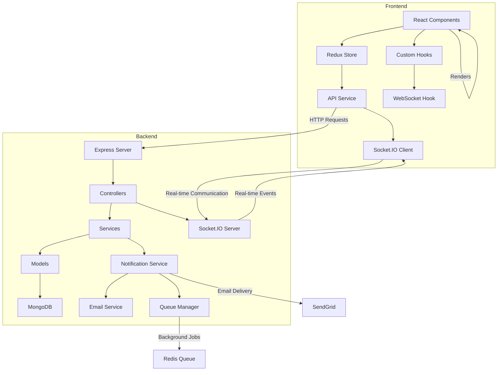

# 🎯 Trello-Style Project Management Dashboard

A comprehensive full-stack project management application with real-time collaboration, email-based authentication, and advanced notification system. Built with modern web technologies for scalable and maintainable code.

## ✨ Features

### 🔐 **Authentication System**
- **Email-based OTP login** (no password required)
- Secure JWT token-based authentication
- Automatic session management and persistence
- Protected routes with role-based access

### 📋 **Project & Task Management**
- **Project Dashboard** - Create, view, and manage multiple projects
- **Kanban Board Interface** - Drag & drop task management across phases
- **Task CRUD Operations** - Create, read, update, and delete tasks
- **Real-time Updates** - Instant synchronization across all connected users
- **Phase Management** - Customizable workflow phases (Proposed, Todo, In Progress, Done, Deployed)

### 👑 **Super-User Controls**
- **Admin Toggle** - Secure password-protected super-user mode
- **Enhanced Metadata** - View creation/update timestamps and user information
- **Conditional Rendering** - Dynamic UI based on user permissions
- **Audit Trail** - Track all system changes and user activities

### 🔔 **Real-time Notifications**
- **Live Activity Feed** - Real-time notifications for active users
- **Email Notifications** - Automatic email delivery for offline users
- **WebSocket Integration** - Instant updates across all connected clients
- **Notification Center** - Centralized notification management
- **Multi-channel Delivery** - Email, UI, and push notification support

### 🎨 **User Interface**
- **Modern Design** - Clean, intuitive interface inspired by Trello
- **Responsive Layout** - Works seamlessly on desktop, tablet, and mobile
- **Drag & Drop** - Intuitive task movement with visual feedback
- **Real-time Feedback** - Instant visual updates and status changes
- **Accessibility** - Keyboard navigation and screen reader support

## 🛠️ Technologies Used

### **Backend Stack**
- **Node.js** - JavaScript runtime environment
- **Express.js** - Web application framework
- **TypeScript** - Type-safe JavaScript development
- **MongoDB** - NoSQL database with Mongoose ODM
- **Socket.IO** - Real-time bidirectional communication
- **JWT** - JSON Web Tokens for authentication
- **SendGrid** - Email delivery service
- **Redis** - Caching and session storage
- **Bull** - Queue management for background jobs
- **Winston** - Structured logging
- **Joi** - Data validation
- **Helmet** - Security middleware
- **CORS** - Cross-origin resource sharing

### **Frontend Stack**
- **React 19** - Modern React with latest features
- **TypeScript** - Type-safe frontend development
- **Vite** - Fast build tool and development server
- **Redux Toolkit** - Predictable state management
- **React Router** - Client-side routing
- **Axios** - HTTP client for API calls
- **Socket.IO Client** - Real-time communication
- **@dnd-kit** - Drag and drop functionality
- **CSS Modules** - Scoped styling
- **ESLint** - Code linting and formatting

## 🏗️ Architecture



## 🚀 Getting Started

### **Prerequisites**
- Node.js (v18 or later)
- MongoDB (local or Atlas)
- SendGrid account (for email notifications)
- Git

### **Installation**

1. **Clone the repository:**
   ```bash
   git clone <repository-url>
   cd trello
   ```

2. **Backend Setup:**
   ```bash
   cd backend
   npm install
   cp env.example .env
   # Edit .env with your configuration
   npm run dev
   ```

3. **Frontend Setup:**
   ```bash
   cd frontend
   npm install
   cp .env.example .env
   # Edit .env with your API URL
   npm run dev
   ```

### **Environment Variables**

**Backend (.env):**
```env
# Server Configuration
NODE_ENV=development
PORT=3001
API_VERSION=v1

# Database Configuration
MONGODB_URI=mongodb://localhost:27017/trello

# JWT Configuration
JWT_SECRET=your-super-secret-jwt-key
JWT_EXPIRES_IN=7d

# Email Configuration
EMAIL_PROVIDER=sendgrid
SENDGRID_API_KEY=your-sendgrid-api-key
SENDGRID_FROM_EMAIL=noreply@yourapp.com
SENDGRID_FROM_NAME=Your App Name

# Super User Configuration
SUPER_USER_PASSWORD=admin123

# Redis Configuration (Optional)
REDIS_HOST=localhost
REDIS_PORT=6379
REDIS_PASSWORD=
REDIS_DB=0

# Rate Limiting
RATE_LIMIT_WINDOW_MS=900000
RATE_LIMIT_MAX_REQUESTS=100
```

**Frontend (.env):**
```env
VITE_API_URL=http://localhost:3001/api/v1
```

## 🎯 Key Features Implementation

### **1. Email-based Authentication**
- OTP generation and validation system
- Secure token management with JWT
- Session persistence across browser refreshes
- Automatic token refresh mechanism

### **2. Real-time Collaboration**
- WebSocket connection management
- Live task movement notifications
- User presence tracking
- Conflict resolution for simultaneous edits

### **3. Super-User Mode**
- Password-protected admin toggle
- Conditional UI rendering based on permissions
- Enhanced metadata display
- Audit trail for all changes

### **4. Notification System**
- Multi-channel delivery (Email, UI, Push)
- Offline user email notifications
- Real-time UI notifications
- User preference management

## 🔒 Security Features

- **JWT Authentication** - Secure token-based authentication
- **Password Protection** - Super-user mode security
- **Input Validation** - Server-side validation with Joi
- **CORS Configuration** - Secure cross-origin requests
- **Rate Limiting** - API protection against abuse
- **Helmet Security** - Security headers and protection
- **Environment Variables** - Sensitive data protection

## 📱 Deployment

### **Backend (Railway)**
- Automatic deployment from GitHub
- Environment variable configuration
- MongoDB Atlas integration
- SendGrid email service
- Redis caching support

### **Frontend (Vercel)**
- Automatic deployment from GitHub
- Environment variable configuration
- CDN optimization
- SSL certificate
- Edge functions support

## 🧪 Testing

### **Manual Testing Checklist**

1. **Authentication Flow**
   - [ ] Email OTP login
   - [ ] Session persistence
   - [ ] Logout functionality
   - [ ] Token refresh

2. **Project Management**
   - [ ] Create new projects
   - [ ] View project details
   - [ ] Task management
   - [ ] Project deletion

3. **Super-User Mode**
   - [ ] Toggle with password
   - [ ] Enhanced view display
   - [ ] Conditional rendering
   - [ ] Audit trail

4. **Real-time Features**
   - [ ] Live updates
   - [ ] Notification system
   - [ ] User presence
   - [ ] WebSocket reconnection

## 🎨 UI/UX Features

- **Clean Design** - Minimal, professional interface
- **Responsive Layout** - Works on all devices
- **Intuitive Navigation** - Easy-to-use interface
- **Real-time Feedback** - Instant visual updates
- **Accessibility** - Keyboard navigation support
- **Loading States** - Shimmer effects and skeleton screens
- **Error Handling** - User-friendly error messages

## 🔧 Code Quality

- **TypeScript** - Full type safety across the stack
- **ESLint** - Code linting and formatting
- **Modular Architecture** - Clean separation of concerns
- **Error Handling** - Comprehensive error management
- **Logging** - Detailed application logging
- **Code Splitting** - Optimized bundle sizes
- **Memoization** - Performance optimization

## 📊 Performance

- **Optimized Rendering** - React.memo and useMemo for performance
- **Efficient State Management** - Redux with selectors
- **WebSocket Optimization** - Connection pooling and reconnection
- **Database Indexing** - Optimized MongoDB queries
- **CDN Delivery** - Fast static asset delivery
- **Lazy Loading** - Component and route-based code splitting
- **Caching** - Redis-based caching for frequently accessed data

## 🚀 Future Enhancements

- [ ] File upload functionality
- [ ] Advanced filtering and search
- [ ] Team collaboration features
- [ ] Mobile app development
- [ ] Advanced analytics and reporting
- [ ] Integration with external tools (Slack, GitHub)
- [ ] Advanced notification preferences
- [ ] Dark mode theme
- [ ] Keyboard shortcuts
- [ ] Bulk operations
- [ ] Export/import functionality

## 📄 License

This project is licensed under the MIT License - see the [LICENSE](LICENSE) file for details.

## 👥 Contributing

1. Fork the repository
2. Create a feature branch (`git checkout -b feature/amazing-feature`)
3. Commit your changes (`git commit -m 'Add some amazing feature'`)
4. Push to the branch (`git push origin feature/amazing-feature`)
5. Open a Pull Request

## 🤝 Support

If you have any questions or need help, please:
- Open an issue on GitHub
- Check the documentation
- Review the code comments

---

**Built with ❤️ using modern web technologies**

*This project demonstrates modern full-stack development practices with real-time features, type safety, and scalable architecture.*